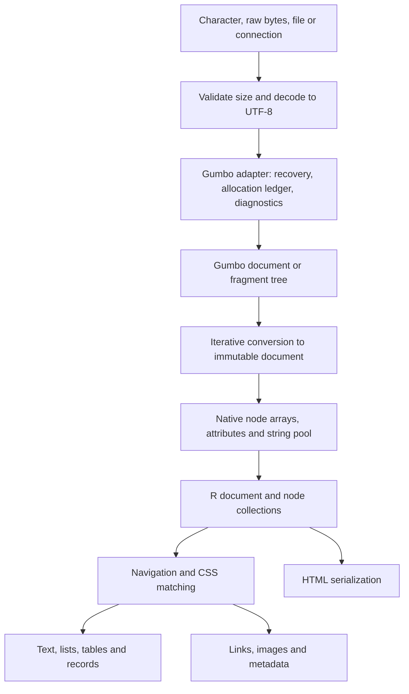

# zuhtml design

Status: proposed implementation design; no APIs described here are implemented yet.

Date: 2026-09-24.

Audience: package maintainers and implementers. The public API examples also serve as acceptance criteria.

## 1. Purpose and decisions

zuhtml is a small R package for parsing real-world HTML and extracting useful R objects. It accepts omitted end tags, HTML entities, unquoted attributes, and malformed nesting using an HTML parser's recovery rules. Its main outputs are character vectors, node collections, lists, and ordinary data frames.

The package uses the maintained [Gumbo fork](https://codeberg.org/gumbo-parser/gumbo-parser), initially pinned to release 0.13.2. It does not use the abandoned Google repository. Gumbo is C99, has no external runtime dependencies, and is licensed Apache-2.0. Its public API accepts a complete UTF-8 buffer and returns a tree; fragments and source positions are supported. It supplies neither CSS selection nor an R extraction API. [Gumbo README mirror](https://repo.or.cz/gumbo-parser.mirror.git)

Core decisions:

- Vendor Gumbo and compile it with the R package; require no system HTML library, Python, C++, or browser.
- Expose an immutable document with vectorized accessors, broadly familiar to zuxml users.
- Use CSS selectors for normal extraction, with a documented supported subset. Do not translate CSS to XPath or depend on libxml2.
- Make `html_list()` and `html_table()` first-class extraction functions with deterministic handling of nested content and missing values.
- Keep extraction separate from downloading, JavaScript execution, and form submission.
- Default to character data rather than guessing types that can destroy identifiers or leading zeroes.
- Make malformed-HTML recovery normal; distinguish it from resource exhaustion and unsupported selectors.
- Treat safe allocation failure and bounded parser work as release gates, not properties obtained merely by choosing Gumbo.

The new wrapper and extraction code may use MIT licensing, while bundled Gumbo retains Apache-2.0 and its notices. The distributed package must document both components and their provenance; it must not describe all bundled code as MIT. Review DESCRIPTION license metadata against the final source layout before release.

## 2. Product scope and Python precedents

The following are usability precedents, not promises of identical behavior. The contracts in subsequent sections are zuhtml design choices.

| Python precedent | Useful capability | zuhtml proposal |
|---|---|---|
| Beautiful Soup | Find elements, CSS queries, attributes, descendant text, traversal | `html_element()`, `html_elements()`, `html_find()`, `html_attr()`, `html_text()`, navigation helpers |
| pandas `read_html()` | Extract tables, account for spans, choose headers | `html_table()`, `html_tables()`, explicit header and span policies |
| lxml.html | Links, base URLs, forms, HTML serialization | `html_links()`, `html_url()`, later `html_forms()`, `html_serialize()` |
| Parsel / Scrapy selectors | Extract repeated records using queries scoped to each item | `html_records()` and `html_field()` |
| selectolax | Fast native tree access, selection, structured text extraction | Native parsing and matching, `html_text()`, `html_text_clean()` |

Sources: [Beautiful Soup](https://www.crummy.com/software/BeautifulSoup/bs4/doc/), [pandas](https://pandas.pydata.org/docs/reference/api/pandas.read_html.html), [lxml.html](https://lxml.de/lxmlhtml.html), [Parsel](https://parsel.readthedocs.io/en/latest/usage.html), [selectolax](https://selectolax.readthedocs.io/en/latest/parser.html).

### First release

Parsing documents and contextual fragments; immutable nodes; navigation; the defined CSS subset; attributes and text; lists and definition lists; tables; links, images, headings and metadata; normalized HTML serialization; structured conditions and bounded diagnostics.

### Subsequent releases

Declarative record extraction; form inspection; JSON-LD extraction; selector extensions backed by use cases; a versioned C consumer interface once R semantics stabilize. These features are specified below to guide architecture, but are not all blockers for 0.1.0.

### Outside scope

Browser layout, computed visibility, JavaScript execution, crawling, sessions, requests, form submission, article-readability scoring, HTML sanitization, arbitrary DOM mutation, XPath, and a complete CSS engine. A browser or HTTP package can supply fetched markup to zuhtml. No API fetches an extracted URL implicitly.

## 3. Relationship to zuxml

The inspected zuxml checkout reports version 0.1.0; its HEAD was `836d211c3f92a5df2f0b2c048da90074e646a708`. Inspection included the working-tree files, which may differ from that commit.

Useful existing patterns, with paths relative to the zuxml repository:

| Existing component | Symbols / purpose | Treatment in zuhtml |
|---|---|---|
| `R/node.R`, `R/nodeset.R` | `new_nodeset()`, document ownership, vectorized accessors | Follow the ownership and vectorization pattern with independent classes |
| `R/parse.R` | `xml_parse()`, `xml_read()` | Keep explicit in-memory versus file entry points |
| `src/zux_parser.c` | Expat event adapter, options, limits | Design a separate Gumbo adapter |
| `src/zux_tree.c`, `src/zux.h` | Immutable arrays, node IDs, string storage | Reuse the architectural approach, subject to HTML node requirements |
| `src/zux_write.c` | XML serialization | Implement HTML serialization separately |
| `src/zux_register.c`, `inst/include/zuxml.h` | Registered native API | Consider an analogous zuhtml API after stabilization |
| `src/Makevars` | Vendored native build | Keep portable R build integration |

HTML tree construction can move nodes and insert implied elements. Gumbo must finish constructing its tree before it is frozen into zuhtml's representation. Its tokenizer cannot simply replace Expat's ordered start/end callbacks. HTML processing rules are defined by the [HTML parsing specification](https://html.spec.whatwg.org/multipage/parsing.html).

zuhtml does not depend on zuxml, export its classes, or claim binary compatibility. Share tested conventions rather than coupling two different document models. In particular, zuhtml supports a document node, a document fragment, HTML/SVG/MathML namespaces, doctype metadata, and template content.

## 4. Architecture and ownership



### Native document

One document owns contiguous node and attribute arrays, interned names where useful, a UTF-8 string pool, document metadata, and compact diagnostics. Nodes store their type, namespace, parent, first child, next sibling, and value/name offsets. Build previous-sibling and preorder/subtree-end indexes if measurements justify them. Use indices rather than addresses so growth during construction cannot invalidate references.

Copy Gumbo's final topology, normalized names, decoded strings, and relevant insertion flags. Preserve unknown/custom element names, comments when requested, and foreign-content namespaces. Do not retain native Gumbo structs in the public representation.

Gumbo borrows pieces of its input buffer. Keep that buffer alive through parsing, conversion, and Gumbo cleanup. Free the Gumbo tree and input after conversion unless source retention was requested. At conversion time, both trees exist: peak memory accounting must include this overlap.

### R representation

- `zuhtml_document`: an external pointer with a finalizer plus small immutable metadata.
- `zuhtml_nodeset`: an integer vector of node IDs and a strong reference to its owning document. Length one represents a single node.
- Missing nodes: `NA_integer_` IDs, used by aligned operations. These are distinct from a zero-length collection.
- Document node: a real internal ID. `html_root()` returns the HTML root element for a document and the fragment root for a fragment.
- `html_document(x)` returns the owner; `html_type()` distinguishes document, fragment, element, text, comment, and doctype.

ID counts are checked before conversion to R integers and stay below the reserved missing value. Validate pointer tags, liveness, ownership, and node bounds at every native entry point. Finalization is idempotent. A nodeset keeps its document alive; nodes from different documents cannot be concatenated.

`[`, `[[`, `length()`, `rev()`, and `c()` preserve classes and ownership. Subsetting can preserve missing slots. Printing is bounded and never prints an entire document by default. Serialized R external pointers are not portable documents: document this and provide `html_serialize()` for persistence. An unserialized dead pointer raises a structured error.

Template contents live in a separate fragment associated with the template node. Ordinary descendant selectors do not cross this boundary. `html_template_content()` exposes the fragment explicitly. The adapter must map and test Gumbo's template representation rather than assuming ordinary children are sufficient.

## 5. Parsing and input contracts

Proposed signatures:

```r
html_parse(x, encoding = NULL, base_url = NULL,
           comments = TRUE, keep_source = FALSE,
           errors = c("collect", "warn", "error"),
           limits = html_limits())
html_read(path, ...)
html_read_connection(con, ...)
html_fragment(x, context = "div", namespace = "html", ...)
html_problems(x)
html_info(x)
zuhtml_info()
```

`html_parse()` accepts exactly one non-missing character string or one raw vector. It does not guess whether a string is a file path or URL, and does not concatenate character vectors. Empty input is valid and produces an empty HTML document with the implied structure. `html_read()` accepts one local file path; it never interprets a URL as a file to download. Connection input is buffered under the input limit, and a caller-owned connection is not closed.

Gumbo is a whole-buffer parser. Reading a connection in chunks does not make parsing incremental or constant-memory. Do not expose an Expat-like `feed()` API in the first version.

### Encoding

Character input is normalized with `enc2utf8()`; reject strings marked as bytes. An `encoding` argument on character input must be absent or UTF-8, avoiding accidental double decoding.

Raw input uses a documented initial policy: explicit encoding, otherwise a recognized UTF-8/UTF-16 BOM, otherwise UTF-8. Explicit contradictory BOMs are errors. Strip a matching BOM after decoding. Convert supported non-UTF-8 encodings through R's conversion facilities; report unavailable encodings and invalid byte sequences instead of substituting silently. Reject embedded NUL bytes after decoding because R character values cannot represent them reliably.

Version 0.1 does not claim browser encoding sniffing from `<meta charset>` or HTTP headers. A fetcher can pass the HTTP charset explicitly. Store selected encoding and any detected declaration separately. A later HTML encoding-sniffing implementation must use the standard algorithm and label aliases, not a regular expression over arbitrary markup.

### Recovery, fragments, and diagnostics

Gumbo performs normal HTML repair by default, including implied elements and named character references. HTML doctype declarations are accepted as metadata; external DTDs and arbitrary XML entity expansion are not implemented. Record quirks mode.

`html_fragment()` supplies the context element and namespace to Gumbo; `<tr>` in a table context is not equivalent to `<tr>` in a div. Initially accept context names represented by the pinned Gumbo API; reject unsupported contexts. Document any fixed scripting-state behavior of the pinned parser; this is not JavaScript execution.

`errors = "collect"` records bounded recoverable diagnostics without warnings. `"warn"` emits one summarized warning per parse. `"error"` rejects recovered input with diagnostics and never returns a partial document. It is a parser diagnostic policy, not a full HTML conformance validator.

`html_problems()` returns `stage`, `severity`, `code`, `message`, `line`, `column`, and `byte_offset`; absent positions are `NA`. Offsets are zero-based into the decoded UTF-8 input, while line and column numbers follow the documented Gumbo convention. They are not offsets into a transcoded original file. Cap retained diagnostics and expose truncation.

Gumbo's detailed error representation is internal. Isolate access in a version-specific adapter and translate to package-owned codes. Never expose Gumbo structs or numeric enums as a stable R contract.

`html_info()` reports counts, estimated owned native bytes, parse mode, encoding, base URL, quirks mode, source retention, and diagnostic truncation. `zuhtml_info()` reports the bundled version, patch identity, selector support, and compiled resource-policy capabilities.

## 6. Selection, navigation, and vectorization

```r
html_elements(x, css, group = FALSE)
html_element(x, css)
html_find(x, name = NULL, attr = NULL, value = NULL,
          text = NULL, fixed = TRUE, recursive = TRUE)
html_children(x, elements_only = TRUE)
html_parent(x)
html_ancestors(x)
html_next_sibling(x, elements_only = TRUE)
html_previous_sibling(x, elements_only = TRUE)
html_filter(x, css)
html_matches(x, css)
html_template_content(x)
```

`html_elements()` returns all matching descendants. A document search includes its root element. An element search excludes the context element unless `:scope` explicitly selects it. With several contexts, the default is a deduplicated union in document order; `group = TRUE` returns one nodeset per input context, including empty groups.

`html_element()` returns the first match per context and preserves input length and order. A missing match becomes a missing node. This prevents separate extractions of titles and prices from becoming misaligned. Repeated contexts can produce repeated nodes. Zero input contexts produce zero results.

`html_parent()` and sibling accessors also preserve length, including missing parents/siblings. Multi-result traversals flatten and deduplicate in document order. Accessors return one result per node; missing nodes give typed missing values. `html_matches()` returns logical values with `NA` for missing nodes. `html_filter()` drops nonmatches and missing nodes.

`html_find()` is a simpler alternative for tag, attribute, and text searches. `attr` and `value` are scalar: `attr` alone means presence, while `value` requires `attr`. `text` matches descendant structural text; `fixed = FALSE` opts into R regular expressions. Multiple supplied filters are ANDed. Query results follow the same ordering and scoping conventions as CSS selection. Regex execution is delegated to R and is not covered by the native selector work counter; document that distinction and constrain pattern/input sizes. Do not promise a hard regex execution-time bound.

### CSS subset for 0.1

Support type and universal selectors; `#id`; `.class`; attribute presence and `=`, `~=`, `|=`, `^=`, `$=`, `*=`; descendant, child, adjacent-sibling and general-sibling combinators; selector lists; `:scope`, `:root`, `:empty`, `:first-child`, `:last-child`, `:only-child`, `:nth-child(an+b)`, `:nth-of-type(an+b)`, and `:not()` with one compound selector argument.

Specify CSS whitespace, identifier escapes, string escapes, and attribute `i`/`s` flags in parser tests. HTML tag names are ASCII-insensitive; class and ID values remain case-sensitive. Attribute values follow the implemented HTML/CSS case rules, with explicit flags taking precedence. Structural pseudo-classes count element siblings, not text/comments. For `:empty`, use the established Selectors Level 3 behavior: an element with any nonempty text child, including whitespace, is not empty; comments do not matter. Operate in standards-mode selector semantics even for quirks-mode documents and document these compatibility choices.

Reject unsupported syntax with `zuhtml_selector_error`, including `:has()`, pseudo-elements, XPath, Parsel's `::text`/`::attr`, and namespace prefixes in 0.1. No silent partial matching. Unprefixed type selectors initially target HTML-namespace elements; expose namespace-aware tag search separately before advertising SVG/MathML CSS coverage. `html_name()` and `html_namespace()` still permit inspection of foreign content.

Implement a small selector parser producing a native query plan and match right-to-left. Cache compiled selectors only within a bounded per-document cache or a single extraction call. Bound selector length, combinator count, nesting, and matching work; interrupt long queries. Gumbo does not provide this engine. Do not claim full CSS Selectors Level 4 support.

## 7. Attributes, text, and HTML output

```r
html_name(x)
html_namespace(x)
html_type(x)
html_attr(x, name, default = NA_character_)
html_attrs(x)
html_has_attr(x, name)
html_classes(x)
html_text(x, recursive = TRUE)
html_text_clean(x, trim = TRUE, nbsp = TRUE)
html_strings(x, trim = FALSE, drop_empty = FALSE)
html_serialize(x, outer = TRUE)
html_write(x, path, ...)
html_source_position(x)
```

`html_attrs()` and `html_classes()` return one named character vector or token vector per node in a list. Missing attributes differ from present empty attributes. Test boolean attributes by presence, not by the textual value `"true"`. Preserve custom/data/ARIA attributes and decoded entity values. Duplicate attributes follow Gumbo's HTML recovery outcome; do not invent a second resolution policy.

`html_text()` concatenates text in tree order without inserting separators or trimming. With `recursive = FALSE`, it reads direct text children only. Comments and doctype text are excluded; script/style text is retained in this structural accessor. An empty element yields `""`; a missing node yields `NA_character_`.

`html_text_clean()` is an extraction-oriented alternative. It skips script/style and unentered template content, collapses HTML ASCII whitespace outside preformatted regions, adds line breaks at `<br>` and documented block boundaries, and preserves `<pre>`/`<textarea>` whitespace. `nbsp = TRUE` converts nonbreaking spaces to regular spaces before normalization. It uses a fixed, tested HTML tag list rather than computed CSS. It is not browser `innerText` and makes no claim to visual layout or visibility. `html_strings()` returns a list of descendant text-piece vectors, preserving boundaries.

Serialization emits normalized HTML, not a reconstruction of the input bytes. Use HTML void-element and raw-text rules, appropriate escaping, namespaces for foreign content, doctype handling, comments, and explicit template contents. Apply context-aware fragment serialization. Iterative traversal avoids C-stack dependence. Reparse tests compare the representable tree semantics, not original lexical spelling.

Source positions are provenance hints: inserted/reconstructed nodes may have no direct source span. Expose start-tag and end-tag positions separately with `NA` where unavailable. Do not offer a generic contiguous "original subtree HTML" slice: repaired trees can reorder source content. `keep_source = TRUE` retains the complete decoded source for diagnostic use under the memory budget.

## 8. Lists: `html_list()` and `html_lists()`

```r
html_list(x, mode = c("text", "tree", "data.frame"),
          nested_text = FALSE)
html_lists(x, css = "ul, ol", nested = FALSE, ...)
html_dl(x)
```

`html_list()` requires exactly one nonmissing `<ul>` or `<ol>` node. It never silently chooses the first list from a document. `html_lists()` discovers matching list elements and always returns an ordinary R list of extracted results; no matches produce `list()`. By default it retains only selected lists without a selected list ancestor. `nested = TRUE` includes nested lists as separate results and is deliberately duplicative.

In text mode, return one character string per direct `<li>` child, using cleaned text. Nested `<ul>`/`<ol>` subtrees are excluded by default, so child items do not leak into their parent's text. Inline formatting is included. `nested_text = TRUE` includes nested item text using documented newline boundaries. Empty items remain `""`; source order and duplicate items are preserved.

Tree mode returns a `zuhtml_list` R object: `type` (`ul` or `ol`), `start`, `reversed`, and an `items` list. Each item has `text`, `value` (ordered-list ordinal or `NA_integer_`), and `children` (a list of nested `zuhtml_list` objects). Recursion follows nested lists owned by that `<li>`, including lists inside wrapper elements, and never copies grandchildren twice. The item's own text excludes those child lists. In tree mode `nested_text = TRUE` is rejected to avoid duplicative structure.

Data-frame mode flattens tree mode into `item_id`, `parent_id`, `depth`, `list_type`, `ordinal`, and `text`; IDs are local to that result, root items have missing parents, and depth starts at one. It honors `<ol start>`, `<ol reversed>`, and `<li value>` using HTML integer rules. An omitted start on a reversed list starts at its item count. CSS counters and alphabetic/Roman marker rendering are out of scope. Invalid or out-of-range numbering falls back with an extraction diagnostic rather than wrapping an integer.

```r
doc <- html_parse("<ul><li>Apples<li>Tools<ul><li>Hammer<li>Saw</ul></ul>")
items <- html_element(doc, "ul")
html_list(items)
# c("Apples", "Tools")
html_list(items, mode = "tree")
# A list tree: Tools owns a child list with Hammer and Saw.
```

`html_dl()` requires one `<dl>` and returns a data frame with list-columns `terms` and `definitions`, one row per HTML definition group. Support multiple `<dt>` and `<dd>` entries and the permitted `<div>` group wrappers. Associate adjacent term runs with following definition runs within their group; orphan terms/definitions form explicit groups with an empty opposite vector and a problem entry. Descendant nested definition lists are not merged into the parent. This avoids silently turning many-to-many definitions into a lossy named vector.

## 9. Tables: `html_table()` and `html_tables()`

```r
html_table(x, header = "auto", span = c("repeat", "anchor"),
           trim = TRUE, na = character(),
           col_types = NULL, decimal_mark = ".", grouping_mark = NULL,
           nested_text = FALSE, name_repair = c("unique", "minimal"),
           limits = html_extract_limits())
html_tables(x, css = "table", nested = FALSE, ...)
html_table_cells(x)
html_table_meta(x)
html_extraction_problems(x)
```

`html_table()` requires one nonmissing `<table>` node and returns a base data frame of class `c("zuhtml_table", "data.frame")`, with extraction metadata. `html_tables()` accepts a document or nodeset and always returns a list of such frames. No matches produce `list()`. Only selected outermost tables are included unless `nested = TRUE`.

### Grid construction

1. Select rows whose nearest table ancestor is the target table. Select cells whose nearest row ancestor is the current row and nearest table ancestor is the target table. Nested table rows never become parent rows.
2. Enumerate `<thead>`, body row groups, and `<tfoot>` in logical table order: head, bodies, foot; preserve order within each category. Record each row's source node and group. Direct rows, if present in the parsed tree, form an implicit body group.
3. Parse span attributes using HTML nonnegative-integer parsing: missing/invalid spans use one; zero colspan becomes one; clamp colspan to 1,000 and rowspan to 65,534. `rowspan="0"` extends to the end of its row group. As an explicit zuhtml extraction policy, positive rowspans are clipped to actual rows remaining in that group, with a diagnostic when clipping occurs. Do not allocate synthetic rows beyond the group.
4. Place each cell at the next unoccupied column of its row. Reserve its span rectangle and check bounds before allocating. A rectangle intersecting an occupied slot raises `zuhtml_table_structure_error` with row/cell provenance; do not silently overwrite values.
5. Allocate only within configured row, column, and total-slot limits. A span expansion is checked before multiplication and allocation, including integer overflow.
6. `span = "repeat"` copies the anchor value into every covered slot. `"anchor"` keeps the value at the top-left and fills other covered slots with `NA_character_`. Gaps in ragged rows are always `NA_character_`; an explicitly empty cell is `""`.

Nested tables are excluded from a parent cell's extracted text by default, while other cell text remains. `nested_text = TRUE` includes their text but never their rows. Whitespace handling uses the text-cleaning rules; `trim = FALSE` disables outer trimming without changing grid construction. Footers remain data rows and are identified in metadata.

### Header selection

- `header = "auto"`: use rows in `<thead>` if present; otherwise use the leading consecutive all-`<th>` rows. A row-header `<th>` in a mixed body row does not make that row a header.
- `header = FALSE`: keep all rows as data and generate `V1`, `V2`, etc.
- `header = TRUE`: use the first logical row.
- A positive integer vector: use those one-based logical rows, in increasing order, and remove them from data. Reject invalid indices.

Build header labels from a repeat-expanded header grid even when body `span = "anchor"`. Join nonempty components with `" / "`, collapsing consecutive repeated components created by spans. Preserve the full header matrix in metadata. Blank resulting names become `V<column>`; `name_repair = "unique"` then uses a documented deterministic suffix policy (base `make.unique()`). `"minimal"` preserves duplicate and blank labels. Do not convert non-syntactic labels to syntactic R names by default.

An entirely empty table yields a zero-row, zero-column frame. A header-only table yields a zero-row frame with the selected column names. Do not accidentally infer numeric zero-length columns for a character-default result.

### Types, missing values, and provenance

`col_types = NULL` keeps all columns character. `na` is an explicit set of strings applied after text normalization; the default does not treat literal `"NA"`, `"null"`, or empty cells as missing. Structural missing slots remain missing regardless of `na`.

Explicit `col_types` supports character, integer, double, and logical, named by unique output column name or supplied positionally for every column. Reject ambiguous named specifications after minimal name repair. Conversions require a complete match, detect integer overflow, and use explicit decimal/grouping marks. Failed conversions raise a typed error with cell coordinates; never quietly truncate values. Dates, currencies, and general guessing remain separate R transformations in 0.1. Preserve source text in cell metadata even after conversion.

`html_table_cells(table_node)` returns one row per original cell, with logical `row`, `column`, `rowspan`, `colspan`, `section`, `is_header`, `text`, and list-columns for `href` values, plus source node IDs and accessible header attributes (`scope`, `headers`). It does not duplicate records for spanned slots. Multiple links in a cell are preserved, not reduced to the first.

`html_table_meta(extracted_frame)` returns caption text, table attributes, header matrix, row-group information, span origins, and extraction problems. Metadata is a snapshot; ordinary data-frame transformations may invalidate it. Accessors must detect unsupported/stale metadata where possible, and documentation tells users to capture metadata before reshaping.

Do not expose a misleading `displayed_only` option. The first release includes hidden markup and has no CSS layout engine. Users can filter rows/cells explicitly; any later static hiding heuristic must be named and documented as such.

```r
doc <- html_parse(paste0(
  "<table><thead><tr><th>Product<th>Price</thead>",
  "<tbody><tr><td>0012<td>12.50<tr><td>0034<td>9.00</tbody></table>"
))
tab <- html_table(html_element(doc, "table"))
# Product is c("0012", "0034"); Price is c("12.50", "9.00").
```

## 10. Other useful extraction functions

These helpers return base data frames with stable columns, including typed zero-row results. They use descendants of the supplied contexts; matching context elements themselves are included once. Multi-context inputs are deduplicated in document order. Attribute strings are decoded, not fetched or executed.

| Function | Output contract |
|---|---|
| `html_links(x, absolute = FALSE)` | Anchors/areas with href: `text`, `href`, `url`, `title`, `target`, `rel` token list, and source node ID |
| `html_images(x, absolute = FALSE)` | `src`, `url`, `alt`, `title`, width/height attributes as character, raw `srcset`, `loading`, and source ID |
| `html_headings(x)` | `level` (1–6), `text`, `id`, and source ID; no invented outline hierarchy |
| `html_meta(x)` | Rows for meta elements: `name`, `property`, `http_equiv`, `content`, `charset`; preserve duplicates |
| `html_title(x)` | First document title as one character value, or `NA_character_`; accepts one document |
| `html_description(x)` | First description meta value, falling back to `og:description`; accepts one document |
| `html_canonical(x, absolute = FALSE)` | First canonical link, with missing value if absent; accepts one document |
| `html_data(x)` | One named vector of `data-*` values per node; no implicit JSON or numeric conversion |
| `html_url(x, attr = "href", base_url = NULL, strict = FALSE)` | One resolved reference per node, preserving missing values |

`html_links()` preserves duplicate destinations and fragment/mailto/tel references. The `url` column equals raw decoded `href` when `absolute = FALSE`; otherwise it is the resolved URL. Missing attributes, empty references, and unavailable base URLs remain distinguishable. Images do not guess a lazy-loading source from arbitrary `data-*` conventions or select a `srcset` candidate without viewport information.

URL resolution is its own tested module, not supplied by Gumbo. Initially implement documented RFC 3986 reference resolution for valid URI references, including dot segments, queries, fragments and protocol-relative references. Do not advertise WHATWG browser URL normalization, IDNA handling, or automatic percent-encoding of arbitrary strings. For a malformed reference, `html_url()` returns `NA` with a problem record, or raises `zuhtml_input_error` when `strict = TRUE`; original attributes remain available. Link/image helpers use non-strict resolution and preserve the original reference in `href`/`src`.

Base precedence: an explicit accessor `base_url` overrides document behavior; otherwise resolve the first valid document `<base href>` against the parse-time base URL, then use the parse-time URL alone. Relative references with no usable absolute base yield `NA` from `html_url()` and a diagnostic; their original attributes remain accessible. Resolving a URL is pure computation and must not trigger I/O.

### Shared extraction diagnostics and provenance

`html_extraction_problems(result)` works on list, table, URL, and helper results and returns a typed zero-row frame when there are no problems. Its columns are `code`, `message`, `node_id`, `item`, `row`, `column`, and `field`; inapplicable coordinates are missing. Store these records in a dedicated result attribute rather than mutating the immutable document's parse diagnostics. Plural extractors retain diagnostics on each member.

Results exposing node IDs retain their originating document through a provenance attribute so the IDs cannot outlive their owner. Document this memory cost; copying out plain columns or dropping provenance produces independent R values. Node IDs are document-local, not stable identifiers across reparses. Plain `html_list(..., mode = "text")` need not retain the document unless diagnostics or explicit provenance require it.

## 11. Repeated records and structured data (later release)

```r
html_records(x, css, fields, problems = c("error", "collect"))
html_field(css = NULL, attr = NULL,
           multiple = FALSE, required = FALSE,
           text = c("clean", "raw"))

products <- html_records(doc, ".product", fields = list(
  name = html_field(".name", required = TRUE),
  price = html_field(".price"),
  href = html_field("a", attr = "href"),
  tags = html_field(".tag", multiple = TRUE)
))
```

One matched record element becomes one row. Each field is queried relative to that record; `css = NULL` means the record itself. Single-valued fields return character columns with `NA` for no match; more than one match is a cardinality error, not an implicit first-match choice. `multiple = TRUE` produces a list-column of character vectors, with `character()` for no matches. Required fields reject no matches or a missing selected attribute; empty-but-present values remain valid. In collect mode preserve the record, use missing/empty output for failed fields, and attach record/field diagnostics. No arbitrary `eval()` or implicit type guessing is involved.

Zero records return a zero-row frame with the schema-defined column types. Fields are evaluated within each record before constructing columns, preventing cross-record recycling. A later conversion stage can explicitly parse price/date text.

`html_json_ld(x)` returns a list of records containing raw text from `script[type='application/ld+json']`, source ID, and parse problems. JSON decoding is optional through an explicitly chosen optional JSON package; retain top-level arrays and `@graph` structures and preserve invalid raw input with diagnostics. It never executes JavaScript. Full microdata and RDFa extraction are deferred rather than conflated with JSON-LD.

`html_forms(x)` returns form descriptors (`action`, `method`, `enctype`, `id`) with control tables containing raw names, types, values, selected options and checked/disabled flags. Associate controls using form ownership, including external `form=` references. Preserve repeated names. Default behavior is inspection only: no credentials, file access, request building, or submission. Exact browser "successful controls" semantics require a separate later contract covering submitters, fieldsets, multiple selects, and disabled controls.

## 12. Safety, failure, and resource limits

### Verified concern in Gumbo 0.13.2

The inspected `src/gumbo.h` includes an allocation-failure TODO. In `src/util.c`, `gumbo_copy_stringz()` uses an allocated pointer without checking it; `src/string_buffer.c` has similar allocation-then-copy paths. Therefore an allocator that simply returns NULL at a memory cap is not safe. This must be resolved before releasing a package advertised for untrusted HTML.

### Proposed adapter policy

Use per-parse allocation bookkeeping for every Gumbo allocation. On allocation failure or a budget breach, the proposed adapter performs a controlled C-only abort to a live parser boundary, then frees all outstanding allocations through the ledger. Do not invoke Gumbo's normal destructor on a partially built tree. The ledger must preserve alignment, check size arithmetic, handle zero-size requests and bookkeeping failure, and track deallocations without double frees.

This approach requires a focused proof-of-concept and audit: no R API calls inside the abortable region, no jumps across C++ frames, safe `setjmp`/`longjmp` state storage, and confirmation that all Gumbo allocations and owned resources are accounted for. An alternative is a reviewed, complete upstream-style error-propagation patch. Release is blocked until one strategy passes fault injection and sanitizer tests. Allocator hooks alone are not sufficient evidence.

Parser loops also need reviewed cancellation/work-budget polling if bounded parse latency is promised. A token loop alone is insufficient for a huge token or expensive tree-repair loop. Keep any local patches minimal, versioned, and isolated from the HTML algorithms. A post-parse depth check cannot protect the parsing phase from every resource issue.

### Initial limits to validate experimentally

| Limit | Proposed default | Enforcement point |
|---|---:|---|
| Original and decoded input | 64 MiB each | Before reading beyond cap and during decoding |
| Owned native memory | 256 MiB | During allocation; includes input copy, Gumbo, frozen tree and simultaneous conversion buffers |
| Final tree depth | 512 | During iterative conversion; explicitly a final-tree limit |
| Final nodes | 1,000,000 | During conversion; additionally require parser work/allocation protections |
| Attributes per element | 4,096 | During conversion; parser allocation budget remains active |
| Collected parse problems | 100 | Gumbo error-recording option and translated diagnostics |
| Expanded table slots | 1,000,000 | Before span expansion / result construction |
| Table rows / columns | 100,000 / 10,000 | Before grid allocation |
| Selector length / combinators | 16 KiB / 128 | Before query execution |

`html_limits()` and `html_extract_limits()` return validated named option objects; reject negative, missing, nonfinite, overflowing or fractional counts. Limits are per operation, not global mutable options. Exact defaults and any parse-work counter require measurement before API freeze. `max_errors` limits diagnostic retention, not total parser work.

The native-memory cap excludes memory already owned by R and R result objects. Bound output counts and checked size arithmetic separately; do not call this a cap on process RSS. Buffering, decoding, source retention, and table expansion must each be accounted for honestly. R allocations can still fail and must unwind native ownership safely.

Wrap R/native transitions in unwind-safe cleanup. Register finalizers only after ownership transfer is clear. Traversal, conversion and serialization use explicit bounded stacks. Cancellation callbacks must turn an R interrupt into a safely cleaned-up operation; never let an uncontrolled R long jump bypass live Gumbo ownership. No worker thread calls the R API.

Condition subclasses include `zuhtml_input_error`, `zuhtml_encoding_error`, `zuhtml_parse_error`, `zuhtml_limit_error`, `zuhtml_selector_error`, `zuhtml_table_structure_error`, `zuhtml_conversion_error`, and `zuhtml_pointer_error`, all under `zuhtml_error`. Include machine-readable fields such as stage, limit, observed size, record index, and cell position where relevant. An operation either returns a valid result or fails after cleanup; it does not silently truncate data.

Parsing is not sanitization. Serialization can preserve script elements and dangerous URL schemes. Document this distinction without presenting the library as a browser security filter.

## 13. Packaging and proposed source organization

Target R >= 4.1 and C99, with no mandatory external R package dependencies for the core. Use base data frames and list-columns; tibble users can convert explicitly. Optional JSON integration and benchmarks belong in Suggests. No network access or source generation during installation.

The measured Gumbo 0.13.2 parser source/header set contains 30 files, about 1.28 MB uncompressed, and about 36,100 lines including comments and generated tables. These are source measurements, not installed-library or memory benchmarks. Its Meson definition lists 11 C translation units; compile the pinned required units directly through portable R Makevars rather than requiring Meson for users.

The downloaded release archive used during this investigation had SHA-256:

`90bea83283760339da194fb90112a532854c13cd1eabdabc7ef7a4dede1dbc9d`

Record the source URL, resolved upstream commit, archive digest, file manifest, licenses and local patch series in `src/vendor/PROVENANCE`. Do not rely on a tag alone. Keep generated tables in the source package; regeneration tools are maintainer-only. Preserve upstream notices and include the Apache license text, even if an upstream snapshot omits a standalone license file. Check all vendored files, not just repository metadata.

Proposed paths are relative to the future zuhtml repository:

| Path | Responsibility |
|---|---|
| `R/parse.R`, `R/conditions.R`, `R/info.R` | Inputs, options, conditions and metadata |
| `R/node.R`, `R/nodeset.R`, `R/select.R` | R objects, vectorization and queries |
| `R/text.R`, `R/attributes.R`, `R/write.R` | Node values, text and serialization |
| `R/list.R`, `R/table.R`, `R/extract.R` | Structured extraction and provenance |
| `R/links.R`, `R/metadata.R` | URL and page metadata helpers |
| `src/zuh_gumbo.c`, `src/zuh_memory.c` | Version-specific adapter, ownership and failure handling |
| `src/zuh_document.c`, `src/zuh_document.h` | Compact immutable representation |
| `src/zuh_selector.c`, `src/zuh_text.c` | Bounded matching and text traversal |
| `src/zuh_table.c`, `src/zuh_write.c` | Checked table-grid construction and HTML serialization |
| `src/r_api.c`, `src/init.c` | Validated .Call entry points and registration |
| `src/vendor/gumbo/` | Pinned upstream sources |
| `tools/vendor-gumbo/` | Maintainer update script, patches and manifest checks |
| `tests/testthat/`, `tests/native/` | R contracts, native conformance, fault injection and fuzz harnesses |
| `vignettes/` | Extraction recipes, selectors, encoding and resource behavior |

Register native routines and disable dynamic symbol lookup. Hide or prefix vendored symbols where needed to prevent collisions with another package bundling Gumbo. Do not export a static Gumbo archive in the first release. Verify macOS, Linux and Windows/Rtools builds, including availability of headers such as `strings.h` and platform-specific string functions in the pinned source.

## 14. Validation and acceptance criteria

### Parser and ownership

Run the pinned upstream tree-construction fixtures, including fragment cases. Add omitted tags, misnested formatting, foster parenting around tables, entity edge cases, comments, doctypes, custom tags, SVG/MathML and templates. Normalize expected results only for explicitly documented representation differences.

Force garbage collection while nodes remain reachable; finalize documents repeatedly in a harness; test dead/deserialized pointers and cross-document concatenation. Inject allocation failure at every allocation index for a diverse small fixture corpus. Verify cleanup under interrupts, decoding errors, conversion errors and serialization errors. Use ASan/UBSan and leak checks where supported.

### Extraction contracts

- Lists: shallow/nested ownership, empty items, wrapper elements, ordered numbering, reversed lists, duplicate text, definition groups and orphan definitions.
- Tables: row/column spans, `rowspan=0`, row-group boundaries, overlap errors, huge spans, ragged rows, empty versus missing cells, multiple header rows, mixed row headers, footer order, nested tables, all-empty tables, leading-zero values, duplicate names and link multiplicity.
- Selectors: every supported production, escaping, case rules, context scoping, duplicate elimination, absent matches, pseudo-class counting and explicit rejection of unsupported syntax.
- Text: inline boundaries, whitespace, NBSP, preformatted content, script/style and template distinctions.
- URLs: relative paths, absolute references, query-only and fragment-only references, dot segments, `<base>`, absent bases and malformed strings. No extraction test should cause network access.
- Records later: zero/one/multiple matches, optional fields, absent attributes, empty text and one row per source record.

Differential tests may use Beautiful Soup with an HTML5 backend and pandas as exploratory comparators, not absolute oracles: backends and extraction conventions differ. Keep Python out of installation and ordinary CRAN tests. Store independent expected fixtures for the package contracts.

### Performance and release gates

Measure parse time, conversion time, peak native allocations, peak process memory, selector cost and extraction cost separately. Include tiny fragments, ordinary pages, large tables, deep documents and malformed repair-heavy inputs. Do not publish generic speed claims from one fixture.

Before release: pass cross-platform R CMD check, upstream/native tests, allocation-failure tests, query/grid limit tests, and license/provenance checks. No safety claim ships while safe Gumbo allocation abort or cancellation remains an unverified design sketch.

## 15. Implementation sequence

1. **Feasibility and safety spike:** pin the fork; compile on all target platforms; prove allocation cleanup and cancellation strategy; assess conversion-time memory; verify template/fragment/source-position behavior. Resolve these gates before building a broad API.
2. **Core document:** parsing, decoding, immutable ownership, diagnostics, navigation, attribute access, structural text, serialization and limits.
3. **Queries and basic extraction:** CSS subset, aligned first matches, cleaned text, lists/definition lists, links, images, headings and metadata.
4. **Tables:** grid and provenance first; spans, header policy and explicit conversion second; lock behavior with fixtures before release.
5. **0.1 release:** documentation, examples, benchmarks, security/encoding limitations and packaging checks.
6. **Extensions:** record schemas, JSON-LD and form inspection; prioritize by actual use. Design and freeze a registered C interface only after ownership and error semantics are stable.

## 16. Worked extraction workflow

This example uses only proposed 0.1 APIs. Network retrieval happens outside the package.

```r
doc <- html_read("saved-page.html", base_url = "https://example.org/catalog/")

title <- html_title(doc)
headings <- html_headings(doc)
links <- html_links(doc, absolute = TRUE)
images <- html_images(doc, absolute = TRUE)

menus <- html_lists(doc, css = "nav ul")
tables <- html_tables(doc)

cards <- html_elements(doc, ".product")
products <- data.frame(
  name = html_text_clean(html_element(cards, ".name")),
  price = html_text_clean(html_element(cards, ".price")),
  url = html_url(html_element(cards, "a")),
  stringsAsFactors = FALSE
)

# A card without a price keeps its row and gets NA in that column.
problems <- html_problems(doc)
```

## 17. Evidence and design boundaries

Primary references were checked on 2026-09-24. Local inspection of Gumbo 0.13.2 included `src/gumbo.h`, `src/util.c`, `src/string_buffer.c`, and `meson.build`. The allocation concern and initial source-size measurements above come from that pinned snapshot. Proposed limits, classes, selector coverage and extraction behavior are decisions for zuhtml, not upstream guarantees.

- [Maintained Gumbo repository](https://codeberg.org/gumbo-parser/gumbo-parser)
- [Gumbo README and maintenance mirror](https://repo.or.cz/gumbo-parser.mirror.git)
- [Original Google repository deprecation notice](https://github.com/google/gumbo-parser)
- [WHATWG HTML parsing](https://html.spec.whatwg.org/multipage/parsing.html)
- [WHATWG HTML tables](https://html.spec.whatwg.org/multipage/tables.html)
- [CSS Selectors specification](https://www.w3.org/TR/selectors-4/)
- [RFC 3986 URI reference resolution](https://www.rfc-editor.org/rfc/rfc3986#section-5)
- [Beautiful Soup documentation](https://www.crummy.com/software/BeautifulSoup/bs4/doc/)
- [pandas read_html](https://pandas.pydata.org/docs/reference/api/pandas.read_html.html)
- [lxml.html documentation](https://lxml.de/lxmlhtml.html)
- [Parsel usage](https://parsel.readthedocs.io/en/latest/usage.html)
- [selectolax parser API](https://selectolax.readthedocs.io/en/latest/parser.html)
