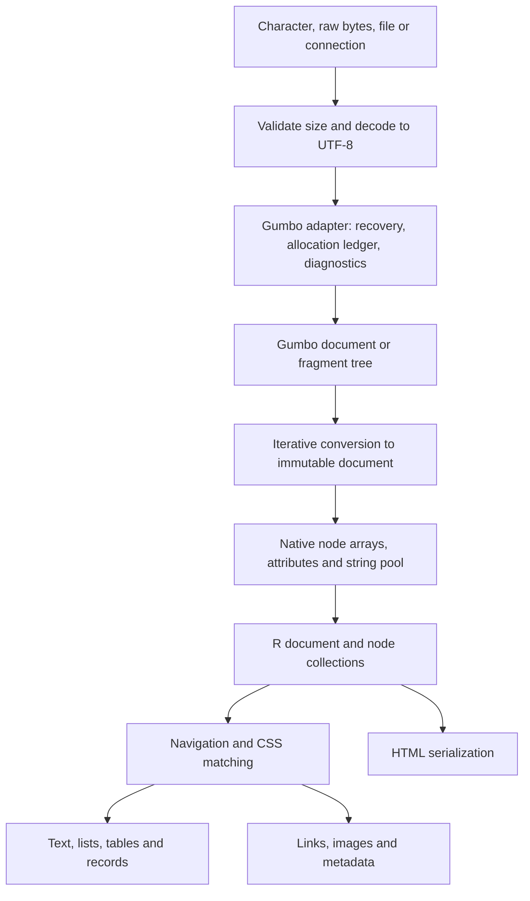

# zuhtml design

Status: implementation design. Amended 2026-09-24 with the seven changes the roadmap's design review requires ([roadmap.md](roadmap.md), "Amendments to make to design.md"). Where a section names a later release, the 0.1.0 surface is the scope table in §2.

Date: 2026-09-24.

Audience: package maintainers and implementers. The public API examples also serve as acceptance criteria.

## 1. Purpose and decisions

zuhtml is a small R package for parsing real-world HTML and extracting useful R objects. It accepts omitted end tags, HTML entities, unquoted attributes, and malformed nesting using an HTML parser's recovery rules. Its main outputs are character vectors, node collections, lists, and ordinary data frames.

The package uses the maintained [Gumbo fork](https://codeberg.org/gumbo-parser/gumbo-parser), pinned to release 0.14.0 (released 2026-08-26; tag commit `f7145e6e7700`). It does not use the abandoned Google repository. Gumbo is C99, has no external runtime dependencies, and is licensed Apache-2.0. Its public API accepts a complete UTF-8 buffer and returns a tree; fragments and source positions are supported. It supplies neither CSS selection nor an R extraction API. [Gumbo README mirror](https://repo.or.cz/gumbo-parser.mirror.git)

Core decisions:

- Vendor Gumbo and compile it with the R package; require no system HTML library, Python, C++, or browser.
- Expose an immutable document with vectorized accessors, broadly familiar to zuxml users.
- Use CSS selectors for normal extraction, with a documented supported subset. Do not translate CSS to XPath or depend on libxml2.
- Make `html_list()` and `html_table()` first-class extraction functions with deterministic handling of nested content and missing values.
- Keep extraction separate from downloading, JavaScript execution, and form submission.
- Default to character data rather than guessing types that can destroy identifiers or leading zeroes.
- Make malformed-HTML recovery normal; distinguish it from resource exhaustion and unsupported selectors.
- Treat safe allocation failure and bounded parser work as release gates, not properties obtained merely by choosing Gumbo.

The new wrapper and extraction code may use MIT licensing, while bundled Gumbo retains Apache-2.0 and its notices. The distributed package must document both components and their provenance; it must not describe all bundled code as MIT. Review DESCRIPTION license metadata against the final source layout before release.

## 2. Product scope and Python precedents

The following are usability precedents, not promises of identical behavior. The contracts in subsequent sections are zuhtml design choices.

| Python precedent | Useful capability | zuhtml proposal |
|---|---|---|
| Beautiful Soup | Find elements, CSS queries, attributes, descendant text, traversal | `html_element()`, `html_elements()`, `html_find()`, `html_attr()`, `html_text()`, navigation helpers |
| pandas `read_html()` | Extract tables, account for spans, choose headers | `html_table()`, `html_tables()`, explicit header and span policies |
| lxml.html | Links, base URLs, forms, HTML serialization | `html_links()`, `html_url()`, later `html_forms()`, `html_serialize()` |
| Parsel / Scrapy selectors | Extract repeated records using queries scoped to each item | `html_records()` and `html_field()` |
| selectolax | Fast native tree access, selection, structured text extraction | Native parsing and matching, `html_text()`, `html_text_clean()` |

Sources: [Beautiful Soup](https://www.crummy.com/software/BeautifulSoup/bs4/doc/), [pandas](https://pandas.pydata.org/docs/reference/api/pandas.read_html.html), [lxml.html](https://lxml.de/lxmlhtml.html), [Parsel](https://parsel.readthedocs.io/en/latest/usage.html), [selectolax](https://selectolax.readthedocs.io/en/latest/parser.html).

### First release (0.1.0)

The principle: an argument or export left out now can be added in a patch release without breaking anyone; one shipped is a commitment. 0.1.0 ships **33 exports**:

| Area | Exports |
|---|---|
| Parse | `html_parse(x, encoding, base_url, comments, limits)`, `html_read(path, ...)`, `html_fragment(x, context, ...)`, `html_problems()`, `html_info()`, `html_limits()`, `zuhtml_info()` |
| Navigate | `html_elements(x, css)`, `html_element(x, css)`, `html_matches()`, `html_filter()`, `html_children()`, `html_parent()`, `html_ancestors()`, `html_next_sibling()`, `html_previous_sibling()`, `html_root()`, `html_document()`, `html_template_content()` |
| Values | `html_name()`, `html_namespace()`, `html_type()`, `html_attr(x, name, default)`, `html_attrs()`, `html_classes()`, `html_text(x, recursive)`, `html_text_clean(x, trim, nbsp)`, `html_serialize(x, outer)` |
| Extract | `html_list(x, mode = c("text", "tree"))`, `html_table(x, header, trim, na, limits)`, `html_tables(x, css)`, `html_links(x, absolute)`, `html_url(x, attr, base_url)` |

Plus S3 methods on `zuhtml_nodeset`: `print`, `format`, `length`, `[`, `[[`, `c`, `rev`, `as.character` (serialize).

Kept although each is a sub-project: the CSS subset of §6 (it is the product); `html_serialize()` (the round-trip oracle); `html_url()` with RFC 3986 §5 resolution; `html_table()` with the full grid algorithm.

Deferred from the surface this design describes: `html_read_connection()`; `keep_source` and `html_source_position()`; `errors=`; `html_extract_limits()` (folded into `html_limits()`); fragment `namespace=`; `group=` on `html_elements()`; `html_find()`; `html_has_attr()`; `html_strings()`; `html_write()`; `html_list(mode = "data.frame")`, `nested_text`, `html_lists()`; `html_dl()`; `span = "anchor"`, `col_types`, `decimal_mark`, `grouping_mark`, `name_repair`, `nested=`, `html_table_cells()`, `html_table_meta()`; `html_images()`, `html_headings()`, `html_meta()`, `html_title()`, `html_description()`, `html_canonical()`, `html_data()`; `strict=` on `html_url()`; `html_extraction_problems()`. Sections below keep their specifications to guide the architecture; each deferred item is marked.

### Subsequent releases

0.1.1 (R only): images, headings, metadata and title helpers, `html_dl()`, list data-frame mode, `html_table_cells()`, `html_lists()`. 0.2.0: record extraction, `col_types`, JSON-LD, fragment `namespace=`. Later: form inspection, encoding sniffing, a versioned C consumer interface once R semantics stabilize.

### Outside scope

Browser layout, computed visibility, JavaScript execution, crawling, sessions, requests, form submission, article-readability scoring, HTML sanitization, arbitrary DOM mutation, XPath, and a complete CSS engine. A browser or HTTP package can supply fetched markup to zuhtml. No API fetches an extracted URL implicitly.

## 3. Relationship to zuxml

The inspected zuxml checkout reports version 0.1.0; its HEAD was `836d211c3f92a5df2f0b2c048da90074e646a708`. Inspection included the working-tree files, which may differ from that commit.

Useful existing patterns, with paths relative to the zuxml repository:

| Existing component | Symbols / purpose | Treatment in zuhtml |
|---|---|---|
| `R/node.R`, `R/nodeset.R` | `new_nodeset()`, document ownership, vectorized accessors | Follow the ownership and vectorization pattern with independent classes |
| `R/parse.R` | `xml_parse()`, `xml_read()` | Keep explicit in-memory versus file entry points |
| `src/zux_parser.c` | Expat event adapter, options, limits | Design a separate Gumbo adapter |
| `src/zux_tree.c`, `src/zux.h` | Immutable arrays, node IDs, string storage | Reuse the architectural approach, subject to HTML node requirements |
| `src/zux_write.c` | XML serialization | Implement HTML serialization separately |
| `src/zux_register.c`, `inst/include/zuxml.h` | Registered native API | Consider an analogous zuhtml API after stabilization |
| `src/Makevars` | Vendored native build | Keep portable R build integration |

HTML tree construction can move nodes and insert implied elements. Gumbo must finish constructing its tree before it is frozen into zuhtml's representation. Its tokenizer cannot simply replace Expat's ordered start/end callbacks. HTML processing rules are defined by the [HTML parsing specification](https://html.spec.whatwg.org/multipage/parsing.html).

zuhtml does not depend on zuxml, export its classes, or claim binary compatibility. Share tested conventions rather than coupling two different document models. In particular, zuhtml supports a document node, a document fragment, HTML/SVG/MathML namespaces, doctype metadata, and template content.

## 4. Architecture and ownership



### Native document

One document owns contiguous node and attribute arrays, interned names where useful, a UTF-8 string pool, document metadata, and compact diagnostics. Nodes store their type, namespace, parent, first child, next sibling, and value/name offsets. Build previous-sibling and preorder/subtree-end indexes if measurements justify them. Use indices rather than addresses so growth during construction cannot invalidate references.

Copy Gumbo's final topology, normalized names, decoded strings, and relevant insertion flags. Preserve unknown/custom element names, comments when requested, and foreign-content namespaces. Do not retain native Gumbo structs in the public representation.

As built (`src/zuh_document.h`): node types document, doctype, element, text, comment and processing instruction. Gumbo's whitespace and CDATA nodes fold into text. A template is an element with a flag. Node IDs are assigned in preorder, and each node records `subtree_end`, its last descendant. ID order is therefore document order, and a node's descendants are exactly the IDs after it up to `subtree_end`. Element names are interned per (tag, namespace); unknown names are ASCII-lowercased from the start tag, and SVG names are case-adjusted as the spec requires. All strings live NUL-terminated in one pool, with offset 0 being `""`. Gumbo keeps the doctype outside its children and does not record its position, so the doctype node is the document's first child. Conversion is two iterative passes: the first counts, enforcing `max_nodes`, a second-line depth check and the memory budget (the frozen size plus Gumbo's live bytes) before anything is allocated; the second fills the arrays.

Gumbo borrows pieces of its input buffer. Keep that buffer alive through parsing and conversion. After conversion, bulk-free the ledger (§12) and drop the input; the frozen document retains neither. At conversion time, both trees exist: peak memory accounting must include this overlap.

### R representation

- `zuhtml_document`: an external pointer with a finalizer plus small immutable metadata.
- `zuhtml_nodeset`: an integer vector of node IDs and a strong reference to its owning document. Length one represents a single node.
- Missing nodes: `NA_integer_` IDs, used by aligned operations. These are distinct from a zero-length collection.
- Document node: a real internal ID. `html_root()` returns the HTML root element for a document and the fragment root for a fragment.
- `html_document(x)` returns the owner; `html_type()` returns one of `"document"`, `"fragment"`, `"doctype"`, `"element"`, `"text"`, `"comment"` and `"processing_instruction"`. The last is a node type Gumbo 0.14.0 added; HTML tokenizes `<?...>` as a bogus comment, so it appears only in foreign content. A `<template>` is an `"element"`: the flag that marks its contents is internal.

ID counts are checked before conversion to R integers and stay below the reserved missing value. Validate pointer tags, liveness, ownership, and node bounds at every native entry point. Finalization is idempotent. A nodeset keeps its document alive; nodes from different documents cannot be concatenated.

`[`, `[[`, `length()`, `rev()`, and `c()` preserve classes and ownership. Subsetting can preserve missing slots. Printing is bounded and never prints an entire document by default. Serialized R external pointers are not portable documents: document this and provide `html_serialize()` for persistence. An unserialized dead pointer raises a structured error.

Template contents are the ordinary children of the template node, as Gumbo represents them (`GUMBO_NODE_TEMPLATE`). There is no separate fragment object. The template node carries a flag; descendant traversal (selectors, `html_text_clean()`, extraction) skips a flagged node's children unless `html_template_content()` returns them explicitly. `html_children()` of the template node itself still lists them.

## 5. Parsing and input contracts

Proposed signatures:

```r
html_parse(x, encoding = NULL, base_url = NULL,
           comments = TRUE, limits = html_limits())
html_read(path, ...)
html_fragment(x, context = "div", ...)
html_problems(x)
html_info(x)
html_limits(...)
zuhtml_info()
```

Deferred past 0.1.0: `html_read_connection()` (a fetcher passes a string), `keep_source`, `errors=` (real pages always have parse errors, so `"warn"` and `"error"` would fire on everything; `html_problems()` is the honest interface), and fragment `namespace=`.

`html_parse()` accepts exactly one non-missing character string or one raw vector. It does not guess whether a string is a file path or URL, and does not concatenate character vectors. Empty input is valid and produces an empty HTML document with the implied structure. `html_read()` accepts one local file path, reads it as raw bytes, and never interprets a URL as a file to download.

Gumbo is a whole-buffer parser. Reading a connection in chunks does not make parsing incremental or constant-memory. Do not expose an Expat-like `feed()` API in the first version.

### Encoding

Character input is normalized with `enc2utf8()`; reject strings marked as bytes. An `encoding` argument on character input must be absent or UTF-8, avoiding accidental double decoding.

Raw input uses a documented initial policy: explicit encoding, otherwise a recognized UTF-8/UTF-16 BOM, otherwise UTF-8. Explicit contradictory BOMs are errors. Strip a matching BOM after decoding. Convert supported non-UTF-8 encodings through R's conversion facilities; report unavailable encodings and invalid byte sequences instead of substituting silently. R's `iconv()` on raw input does not reliably signal invalid sequences: macOS libiconv returns the input bytes unchanged under the default `sub = NA`, and on Windows an invalid UTF-16 input came back with a NUL in it. UTF-16 (LE, BE, and BOM-selected plain "UTF-16", big-endian without a BOM) is therefore decoded in R, strictly: an odd byte count or an unpaired surrogate is an error. Every other encoding is ASCII-compatible, so input with a NUL byte is rejected before conversion, and a conversion fails if two runs with different substitution bytes differ, if the output is identical to input with non-ASCII bytes, if the output contains a NUL, or if it is not valid UTF-8. Reject embedded NUL bytes after decoding because R character values cannot represent them reliably. Raw input longer than four times `max_input` is rejected before decoding, and `html_read()` applies the same bound to the file size before reading.

Version 0.1 does not claim browser encoding sniffing from `<meta charset>` or HTTP headers. A fetcher can pass the HTTP charset explicitly. Store selected encoding and any detected declaration separately. A later HTML encoding-sniffing implementation must use the standard algorithm and label aliases, not a regular expression over arbitrary markup.

### Recovery, fragments, and diagnostics

Gumbo performs normal HTML repair by default, including implied elements and named character references. HTML doctype declarations are accepted as metadata; external DTDs and arbitrary XML entity expansion are not implemented. Record quirks mode.

`html_fragment()` supplies the context element and namespace to Gumbo; `<tr>` in a table context is not equivalent to `<tr>` in a div. Initially accept context names represented by the pinned Gumbo API; reject unsupported contexts. The result is a `zuhtml_document` whose node 0 has type `"fragment"`; `html_root()` returns that node, and its children are the parsed nodes (Gumbo's wrapping `<html>` element is not kept). The conformance runner alone may pass a foreign namespace or a context Gumbo does not know, as upstream's harness does. Document any fixed scripting-state behavior of the pinned parser; this is not JavaScript execution.

Parsing always collects bounded recoverable diagnostics without warnings. It is not a full HTML conformance validator.

`html_problems()` returns a data frame with `stage` (`tokenizer` or `parser`), `code`, `line`, `column`, and `byte_offset`; absent positions are `NA`. Offsets are zero-based into the decoded UTF-8 input; line and column are 1-based, as Gumbo counts them. They are not offsets into a transcoded original file. At most `max_errors` are kept, and attribute `truncated` says whether more occurred. There is no `severity` (every entry is a recoverable parse error) and no `message` (Gumbo's message builder needs its internal parser struct, which is gone once parsing returns); both can be added later without breaking anyone.

Codes are package-owned strings. Tokenizer errors take Gumbo's `GumboErrorType` name in kebab case without the prefix (`duplicate-attr`, `named-char-ref-invalid`); tree-construction errors are `unexpected-<token>` after the token type the parser did not expect (`unexpected-end-tag`); an unacknowledged self-closing flag is `non-void-self-closing-tag`. `src/zuh_gumbo.c` holds the table, with compile-time checks that it matches the pinned Gumbo's enums.

Gumbo's detailed error representation is internal: 42 `GumboErrorType` values in the non-public `error.h`. Isolate access in a version-specific adapter (`src/zuh_gumbo.c`) and translate to package-owned codes; `stage` is `tokenizer` or `parser`. Never expose Gumbo structs or numeric enums as a stable R contract.

`html_info()` reports counts, estimated owned native bytes, parse mode, encoding, base URL, quirks mode, and diagnostic truncation. `zuhtml_info()` reports the bundled version, the applied patch identifiers, selector support, and compiled resource-policy capabilities.

## 6. Selection, navigation, and vectorization

```r
html_elements(x, css)
html_element(x, css)
html_children(x, elements_only = TRUE)
html_parent(x)
html_ancestors(x)
html_next_sibling(x, elements_only = TRUE)
html_previous_sibling(x, elements_only = TRUE)
html_filter(x, css)
html_matches(x, css)
html_root(x)
html_document(x)
html_template_content(x)
```

Deferred past 0.1.0: `group=` on `html_elements()` (`lapply()` does it) and `html_find()` (a second query language to maintain and secure). Their specifications below stay as guidance.

`html_elements()` returns all matching descendants. A document search includes its root element. An element search excludes the context element unless `:scope` explicitly selects it. With several contexts, the result is a deduplicated union in document order.

`html_element()` returns the first match per context and preserves input length and order. A missing match becomes a missing node. This prevents separate extractions of titles and prices from becoming misaligned. Repeated contexts can produce repeated nodes. Zero input contexts produce zero results.

`html_parent()` and sibling accessors also preserve length, including missing parents/siblings; the parent of `<html>` is the document node, which has none. Multi-result traversals flatten and deduplicate in document order; since node IDs are preorder, that is `sort(unique(ids))`. `html_ancestors()` stops below the document node. Accessors return one result per node; missing nodes give typed missing values. `html_matches()` returns logical values with `NA` for missing nodes. `html_filter()` drops nonmatches and missing nodes.

*(Deferred.)* `html_find()` is a simpler alternative for tag, attribute, and text searches. `attr` and `value` are scalar: `attr` alone means presence, while `value` requires `attr`. `text` matches descendant structural text; `fixed = FALSE` opts into R regular expressions. Multiple supplied filters are ANDed. Query results follow the same ordering and scoping conventions as CSS selection. Regex execution is delegated to R and is not covered by the native selector work counter; document that distinction and constrain pattern/input sizes. Do not promise a hard regex execution-time bound.

### CSS subset for 0.1

Support type and universal selectors; `#id`; `.class`; attribute presence and `=`, `~=`, `|=`, `^=`, `$=`, `*=`; descendant, child, adjacent-sibling and general-sibling combinators; selector lists; `:scope`, `:root`, `:empty`, `:first-child`, `:last-child`, `:only-child`, `:nth-child(an+b)`, `:nth-of-type(an+b)`, and `:not()` with one compound selector argument.

Specify CSS whitespace, identifier escapes, string escapes, and attribute `i`/`s` flags in parser tests. HTML tag names are ASCII-insensitive; class and ID values remain case-sensitive. Attribute values follow the implemented HTML/CSS case rules, with explicit flags taking precedence. Structural pseudo-classes count element siblings, not text/comments. For `:empty`, use the established Selectors Level 3 behavior: an element with any nonempty text child, including whitespace, is not empty; comments do not matter. Operate in standards-mode selector semantics even for quirks-mode documents and document these compatibility choices.

Reject unsupported syntax with `zuhtml_selector_error`, including `:has()`, pseudo-elements, XPath, Parsel's `::text`/`::attr`, and namespace prefixes in 0.1. No silent partial matching. Unprefixed type selectors initially target HTML-namespace elements; expose namespace-aware tag search separately before advertising SVG/MathML CSS coverage. `html_name()` and `html_namespace()` still permit inspection of foreign content.

Implement a small selector parser producing a native query plan and match right-to-left. Compile once per call; there is no per-document cache. Bound selector length, combinator count, nesting, and matching work; the R-facing loop polls `R_CheckUserInterrupt()` over the frozen document. Gumbo does not provide this engine. Do not claim full CSS Selectors Level 4 support.

## 7. Attributes, text, and HTML output

```r
html_name(x)
html_namespace(x)
html_type(x)
html_attr(x, name, default = NA_character_)
html_attrs(x)
html_classes(x)
html_text(x, recursive = TRUE)
html_text_clean(x, trim = TRUE, nbsp = TRUE)
html_serialize(x, outer = TRUE)
```

Deferred past 0.1.0: `html_has_attr()` (`!is.na(html_attr())`), `html_strings()`, `html_write()` (`writeLines(html_serialize())`) and `html_source_position()`.

`html_attrs()` and `html_classes()` return one named character vector or token vector per node in a list, with `NA_character_` for a missing node. `html_namespace()` returns namespace URIs (`http://www.w3.org/1999/xhtml`, `…/2000/svg`, `…/1998/Math/MathML`). Attribute names match ASCII-case-insensitively on HTML elements and exactly on foreign ones, as the DOM's `getAttribute()` does; namespaced foreign attributes are named `xlink:href` and so on. Missing attributes differ from present empty attributes. Test boolean attributes by presence, not by the textual value `"true"`. Preserve custom/data/ARIA attributes and decoded entity values. Duplicate attributes follow Gumbo's HTML recovery outcome; do not invent a second resolution policy.

`html_text()` concatenates text in tree order without inserting separators or trimming. With `recursive = FALSE`, it reads direct text children only. Comments and doctype text are excluded; script/style text is retained in this structural accessor; template contents are skipped (a template's text is `""`, as its DOM `textContent` is). An empty element yields `""`; a text, comment or processing-instruction node yields its own content; a doctype or missing node yields `NA_character_`.

`html_text_clean()` is an extraction-oriented alternative. It skips script/style and unentered template content, collapses HTML ASCII whitespace outside preformatted regions, adds line breaks at `<br>` and documented block boundaries, and preserves `<pre>`/`<textarea>` whitespace. `nbsp = TRUE` converts nonbreaking spaces to regular spaces before normalization. It uses a fixed, tested HTML tag list rather than computed CSS. It is not browser `innerText` and makes no claim to visual layout or visibility.

Serialization emits normalized HTML, not a reconstruction of the input bytes. Use HTML void-element and raw-text rules, appropriate escaping, namespaces for foreign content, doctype handling, comments, and explicit template contents. Apply context-aware fragment serialization. Iterative traversal avoids C-stack dependence. Reparse tests compare the representable tree semantics, not original lexical spelling.

*(Deferred.)* Source positions are provenance hints of little value in repaired trees: inserted/reconstructed nodes may have no direct source span, and repair can reorder source content. If they return, expose start-tag and end-tag positions separately with `NA` where unavailable, and never a contiguous "original subtree HTML" slice.

## 8. Lists: `html_list()` and `html_lists()`

```r
html_list(x, mode = c("text", "tree"))
```

Deferred past 0.1.0: `mode = "data.frame"`, `nested_text`, `html_lists()` and `html_dl()`; their specifications below stay as guidance for 0.1.1.

`html_list()` requires exactly one nonmissing `<ul>` or `<ol>` node. It never silently chooses the first list from a document. *(Deferred.)* `html_lists()` discovers matching list elements and always returns an ordinary R list of extracted results; no matches produce `list()`. By default it retains only selected lists without a selected list ancestor. `nested = TRUE` includes nested lists as separate results and is deliberately duplicative.

In text mode, return one character string per direct `<li>` child, using cleaned text. Nested `<ul>`/`<ol>` subtrees are excluded, so child items do not leak into their parent's text. Inline formatting is included. Empty items remain `""`; source order and duplicate items are preserved.

Tree mode returns a `zuhtml_list` R object: `type` (`ul` or `ol`) and an `items` list. Each item has `text` and `children` (a list of nested `zuhtml_list` objects). Recursion follows nested lists owned by that `<li>`, including lists inside wrapper elements, and never copies grandchildren twice. The item's own text excludes those child lists. Ordinals (`start`, `reversed`, `value`) arrive with data-frame mode.

*(Deferred.)* Data-frame mode flattens tree mode into `item_id`, `parent_id`, `depth`, `list_type`, `ordinal`, and `text`; IDs are local to that result, root items have missing parents, and depth starts at one. It honors `<ol start>`, `<ol reversed>`, and `<li value>` using HTML integer rules. An omitted start on a reversed list starts at its item count. CSS counters and alphabetic/Roman marker rendering are out of scope. Invalid or out-of-range numbering becomes `NA` rather than wrapping an integer.

```r
doc <- html_parse("<ul><li>Apples<li>Tools<ul><li>Hammer<li>Saw</ul></ul>")
items <- html_element(doc, "ul")
html_list(items)
# c("Apples", "Tools")
html_list(items, mode = "tree")
# A list tree: Tools owns a child list with Hammer and Saw.
```

*(Deferred.)* `html_dl()` requires one `<dl>` and returns a data frame with list-columns `terms` and `definitions`, one row per HTML definition group. Support multiple `<dt>` and `<dd>` entries and the permitted `<div>` group wrappers. Associate adjacent term runs with following definition runs within their group; orphan terms/definitions form explicit groups with an empty opposite vector. Descendant nested definition lists are not merged into the parent. This avoids silently turning many-to-many definitions into a lossy named vector.

## 9. Tables: `html_table()` and `html_tables()`

```r
html_table(x, header = "auto", trim = TRUE, na = character(),
           limits = html_limits())
html_tables(x, css = "table", ...)
```

Deferred past 0.1.0: `span = "anchor"`, `col_types`, `decimal_mark`, `grouping_mark` (typed conversion is a sub-project; `type.convert()` and readr exist), `nested_text`, `name_repair` (always `make.unique()`), `nested=` (outermost only), `html_table_cells()`, `html_table_meta()`, and `html_extraction_problems()`.

`html_table()` requires one nonmissing `<table>` node and returns a base data frame of character columns. `html_tables()` accepts a document or nodeset and always returns a list of such frames. No matches produce `list()`. Only selected outermost tables are included.

### Grid construction

1. Select rows whose nearest table ancestor is the target table. Select cells whose nearest row ancestor is the current row and nearest table ancestor is the target table. Nested table rows never become parent rows.
2. Enumerate `<thead>`, body row groups, and `<tfoot>` in logical table order: head, bodies, foot; preserve order within each category. Record each row's source node and group. Direct rows, if present in the parsed tree, form an implicit body group.
3. Parse span attributes using HTML nonnegative-integer parsing: missing/invalid spans use one; zero colspan becomes one; clamp colspan to 1,000 and rowspan to 65,534. `rowspan="0"` extends to the end of its row group. As an explicit zuhtml extraction policy, positive rowspans are clipped silently to the actual rows remaining in that group, as pandas does; the clipping is documented. Do not allocate synthetic rows beyond the group.
4. Place each cell at the next unoccupied column of its row. Reserve its span rectangle and check bounds before allocating. A rectangle intersecting an occupied slot raises `zuhtml_table_structure_error` with row/cell position; do not silently overwrite values.
5. Allocate only within the `max_table_cells` limit. A span expansion is checked before multiplication and allocation, including integer overflow.
6. The anchor value is copied into every covered slot (the deferred `span = "anchor"` would keep it at the top-left only). Gaps in ragged rows are always `NA_character_`; an explicitly empty cell is `""`.

Nested tables are excluded from a parent cell's extracted text, while other cell text remains. Whitespace handling uses the text-cleaning rules; `trim = FALSE` disables outer trimming without changing grid construction. Footers remain data rows.

### Header selection

- `header = "auto"`: use rows in `<thead>` if present; otherwise use the leading consecutive all-`<th>` rows. A row-header `<th>` in a mixed body row does not make that row a header.
- `header = FALSE`: keep all rows as data and generate `V1`, `V2`, etc.
- `header = TRUE`: use the first logical row.
- A positive integer vector: use those one-based logical rows, in increasing order, and remove them from data. Reject invalid indices.

Build header labels from the repeat-expanded header grid. Join nonempty components with `" / "`, collapsing consecutive repeated components created by spans. Blank resulting names become `V<column>`; duplicates are then made unique with base `make.unique()`. Do not convert non-syntactic labels to syntactic R names.

An entirely empty table yields a zero-row, zero-column frame. A header-only table yields a zero-row frame with the selected column names. Do not accidentally infer numeric zero-length columns for a character-default result.

### Types, missing values, and provenance

All columns are character. `na` is an explicit set of strings applied after text normalization and trimming; the default does not treat literal `"NA"`, `"null"`, or empty cells as missing. Structural missing slots remain missing regardless of `na`.

*(Deferred.)* Explicit `col_types` supports character, integer, double, and logical, named by unique output column name or supplied positionally for every column. Reject ambiguous named specifications after minimal name repair. Conversions require a complete match, detect integer overflow, and use explicit decimal/grouping marks. Failed conversions raise a typed error with cell coordinates; never quietly truncate values. Dates, currencies, and general guessing remain separate R transformations in 0.1. Preserve source text in cell metadata even after conversion.

*(Deferred.)* `html_table_cells(table_node)` returns one row per original cell, with logical `row`, `column`, `rowspan`, `colspan`, `section`, `is_header`, `text`, and list-columns for `href` values, plus source node IDs and accessible header attributes (`scope`, `headers`). It does not duplicate records for spanned slots. Multiple links in a cell are preserved, not reduced to the first.

*(Deferred.)* `html_table_meta(extracted_frame)` returns caption text, table attributes, header matrix, row-group information and span origins. Metadata is a snapshot; ordinary data-frame transformations may invalidate it. Accessors must detect unsupported/stale metadata where possible, and documentation tells users to capture metadata before reshaping.

Do not expose a misleading `displayed_only` option. The first release includes hidden markup and has no CSS layout engine. Users can filter rows/cells explicitly; any later static hiding heuristic must be named and documented as such.

```r
doc <- html_parse(paste0(
  "<table><thead><tr><th>Product<th>Price</thead>",
  "<tbody><tr><td>0012<td>12.50<tr><td>0034<td>9.00</tbody></table>"
))
tab <- html_table(html_element(doc, "table"))
# Product is c("0012", "0034"); Price is c("12.50", "9.00").
```

## 10. Other useful extraction functions

These helpers return base data frames with stable columns, including typed zero-row results. They use descendants of the supplied contexts; matching context elements themselves are included once. Multi-context inputs are deduplicated in document order. Attribute strings are decoded, not fetched or executed.

0.1.0 ships `html_links()` and `html_url()` without `strict=`; the other rows are deferred to 0.1.1.

| Function | Output contract |
|---|---|
| `html_links(x, absolute = FALSE)` | Anchors/areas with href: `text`, `href`, `url`. Deferred columns: `title`, `target`, `rel` token list, and source node ID |
| `html_images(x, absolute = FALSE)` | `src`, `url`, `alt`, `title`, width/height attributes as character, raw `srcset`, `loading`, and source ID |
| `html_headings(x)` | `level` (1–6), `text`, `id`, and source ID; no invented outline hierarchy |
| `html_meta(x)` | Rows for meta elements: `name`, `property`, `http_equiv`, `content`, `charset`; preserve duplicates |
| `html_title(x)` | First document title as one character value, or `NA_character_`; accepts one document |
| `html_description(x)` | First description meta value, falling back to `og:description`; accepts one document |
| `html_canonical(x, absolute = FALSE)` | First canonical link, with missing value if absent; accepts one document |
| `html_data(x)` | One named vector of `data-*` values per node; no implicit JSON or numeric conversion |
| `html_url(x, attr = "href", base_url = NULL)` | One resolved reference per node, preserving missing values |

`html_links()` preserves duplicate destinations and fragment/mailto/tel references. The `url` column equals raw decoded `href` when `absolute = FALSE`; otherwise it is the resolved URL. Missing attributes, empty references, and unavailable base URLs remain distinguishable. Images do not guess a lazy-loading source from arbitrary `data-*` conventions or select a `srcset` candidate without viewport information.

URL resolution is its own tested module, not supplied by Gumbo. Initially implement documented RFC 3986 reference resolution for valid URI references, including dot segments, queries, fragments and protocol-relative references. Do not advertise WHATWG browser URL normalization, IDNA handling, or automatic percent-encoding of arbitrary strings. For a malformed reference, `html_url()` returns `NA`; original attributes remain available. Link helpers preserve the original reference in `href`.

Base precedence: an explicit accessor `base_url` overrides document behavior; otherwise resolve the first valid document `<base href>` against the parse-time base URL, then use the parse-time URL alone. Relative references with no usable absolute base yield `NA` from `html_url()`; their original attributes remain accessible. Resolving a URL is pure computation and must not trigger I/O.

### No shared extraction diagnostics

0.1.0 has no extraction-diagnostics framework: no `html_extraction_problems()` and no provenance attributes on results. Overlapping table cells are an error. Rowspan clipping is silent and documented. Everything else that would have been a problem record is `NA`. Extraction results are plain R values that hold no reference to the document. Node IDs are document-local, not stable identifiers across reparses.

## 11. Repeated records and structured data (later release)

```r
html_records(x, css, fields, problems = c("error", "collect"))
html_field(css = NULL, attr = NULL,
           multiple = FALSE, required = FALSE,
           text = c("clean", "raw"))

products <- html_records(doc, ".product", fields = list(
  name = html_field(".name", required = TRUE),
  price = html_field(".price"),
  href = html_field("a", attr = "href"),
  tags = html_field(".tag", multiple = TRUE)
))
```

One matched record element becomes one row. Each field is queried relative to that record; `css = NULL` means the record itself. Single-valued fields return character columns with `NA` for no match; more than one match is a cardinality error, not an implicit first-match choice. `multiple = TRUE` produces a list-column of character vectors, with `character()` for no matches. Required fields reject no matches or a missing selected attribute; empty-but-present values remain valid. In collect mode preserve the record, use missing/empty output for failed fields, and attach record/field diagnostics. No arbitrary `eval()` or implicit type guessing is involved.

Zero records return a zero-row frame with the schema-defined column types. Fields are evaluated within each record before constructing columns, preventing cross-record recycling. A later conversion stage can explicitly parse price/date text.

`html_json_ld(x)` returns a list of records containing raw text from `script[type='application/ld+json']`, source ID, and parse problems. JSON decoding is optional through an explicitly chosen optional JSON package; retain top-level arrays and `@graph` structures and preserve invalid raw input with diagnostics. It never executes JavaScript. Full microdata and RDFa extraction are deferred rather than conflated with JSON-LD.

`html_forms(x)` returns form descriptors (`action`, `method`, `enctype`, `id`) with control tables containing raw names, types, values, selected options and checked/disabled flags. Associate controls using form ownership, including external `form=` references. Preserve repeated names. Default behavior is inspection only: no credentials, file access, request building, or submission. Exact browser "successful controls" semantics require a separate later contract covering submitters, fieldsets, multiple selects, and disabled controls.

## 12. Safety, failure, and resource limits

### Verified concerns in Gumbo 0.14.0

`gumbo.h` still carries the out-of-memory `TODO(jdtang)`. `gumbo_copy_stringz()` in `util.c` and the paths in `string_buffer.c` use the result of `gumbo_parser_allocate()` unchecked. An allocator that simply returns NULL at a memory cap is therefore not safe. `GumboOptions` does expose `allocator`, `deallocator` and `userdata` hooks, so the allocation ledger needs no patch.

Parse time is quadratic in nesting depth: 10k nested `<div>` take 0.14 s, 50k 3.5 s, 100k (500 KB of input) 16.3 s; 1M was killed at 120 CPU-seconds. Repeated `<a><b>` (the adoption agency on an ever-growing stack) is quadratic by the same mechanism. The fork has no depth option and no work guard beyond an `assert(loop_count < 1e9)` that `-DNDEBUG` removes. `gumbo_destroy_output()` recurses once per nesting level.

### Adapter policy

**Ledger.** Every Gumbo allocation goes through a per-parse ledger installed via `GumboOptions.allocator/deallocator` (`src/zuh_memory.c`). Each block carries a header `{size, index}`; the ledger is a growable pointer array; deallocation is swap-remove in O(1). It tracks live bytes against `max_memory`, preserves alignment, checks size arithmetic, handles zero-size requests, and detects double frees in debug builds.

**Abort.** On allocation failure, budget breach or ledger growth failure, the allocator `longjmp`s to a `setjmp` in `zuh_gumbo_parse()`. Gumbo is plain C with no destructors, so the only state to unwind is the ledger. The boundary then frees every ledger block in bulk and returns a status enum (`OK`, `LIMIT_MEMORY`, `LIMIT_DEPTH`, `LIMIT_NODES`, `LIMIT_INPUT`, ...). `r_api.c` maps the status to a classed condition after cleanup.

**Bulk free on success too.** `gumbo_destroy_output()` is never called. All Gumbo memory went through the ledger, so bulk free is complete, O(n), non-recursive, and the same code path as failure. There is no partial-tree special case.

**The abortable region is pure C.** `zuh_gumbo_parse()` makes no R API call: `R_CheckUserInterrupt()` or `Rf_error()` there would long-jump past the ledger and leak every block. There are no C++ frames to cross. Release is blocked until fault injection at every allocation index passes under ASan and LeakSanitizer.

**Parse-time depth limit.** Depth is bounded during parsing by a local patch to the vendored Gumbo (`0001-max-tree-depth.patch`, ported from the guard Nokogiri carries): an `unsigned int max_tree_depth` field in `GumboOptions` (0 = unlimited, so `kGumboDefaultOptions` stays compatible), a status field in `GumboOutput`, and a check in the main loop of `gumbo_parse_with_options()` that forces an EOF token once `_open_elements.length` exceeds the limit. The patch is minimal, versioned and offered upstream. The depth check during conversion stays as a second line; on its own it would run after the damage.

**No interrupts on the parse path.** With depth capped at 500, 16 MiB of sawtooth markup parses in 1.5 s and 9 MB of formatting-heavy markup in 0.95 s. Parse latency is therefore bounded by the depth and input caps alone, and 0.1.0 has no cancellation machinery inside the parse. Loops over the frozen document (selector matching, text, tables, serialization) poll `R_CheckUserInterrupt()` and hold nothing a long jump would leak: their temporary buffers come from `R_alloc`.

### Limits

Gumbo's peak allocation, measured with a counting allocator, is about 17× the input for ordinary markup (16.7 MB → 277 MB), about 13× for block nesting, about 47× for formatting-element-heavy markup and about 190× for pure nesting. The input cap and the memory cap are set so that ordinary markup at the input cap fits the memory cap. **The memory cap is the real guard; the input cap is the cheap pre-check.** A 16 MiB formatting-heavy page can trip the memory cap first: that is a classed `zuhtml_limit_error`, not a bug.

| Limit | Default | Enforcement point |
|---|---:|---|
| `max_input` — decoded input | 16 MiB | Before parsing, after decoding |
| `max_memory` — Gumbo native memory | 512 MiB | In the ledger, on every allocation |
| `max_depth` — tree depth | 512 | During parsing (patched Gumbo option); again during conversion |
| `max_nodes` — final nodes | 1,000,000 | During conversion |
| `max_errors` — collected parse problems | 100 | Gumbo's `max_errors` option |
| `max_table_cells` — expanded table slots | 1,000,000 | Before span expansion and result construction |
| `max_selector_length` | 16 KiB | Before selector compilation |

`html_limits()` returns one validated named option object used by parsing and extraction; `html_extract_limits()` is folded into it. It rejects negative, missing, nonfinite, overflowing or fractional counts with `zuhtml_input_error`. Limits are per operation, not global mutable options. The defaults are confirmed against measured peak memory of parse plus conversion at roadmap Stage 8, and this table is updated then. `max_errors` limits diagnostic retention, not total parser work.

The native-memory cap excludes memory already owned by R and R result objects. Bound output counts and checked size arithmetic separately; do not call this a cap on process RSS. Buffering, decoding, source retention, and table expansion must each be accounted for honestly. R allocations can still fail and must unwind native ownership safely.

Wrap R/native transitions in unwind-safe cleanup. Register finalizers only after ownership transfer is clear. Traversal, conversion and serialization use explicit bounded stacks. No R long jump can bypass live Gumbo ownership, because no R API runs while Gumbo memory is live. No worker thread calls the R API.

Condition subclasses include `zuhtml_input_error`, `zuhtml_encoding_error`, `zuhtml_parse_error`, `zuhtml_limit_error`, `zuhtml_selector_error`, `zuhtml_table_structure_error`, `zuhtml_conversion_error`, and `zuhtml_pointer_error`, all under `zuhtml_error`. Include machine-readable fields such as stage, limit, observed size, record index, and cell position where relevant. An operation either returns a valid result or fails after cleanup; it does not silently truncate data.

Parsing is not sanitization. Serialization can preserve script elements and dangerous URL schemes. Document this distinction without presenting the library as a browser security filter.

## 13. Packaging and proposed source organization

Target R >= 4.1 and C99, with no mandatory external R package dependencies for the core. Use base data frames and list-columns; tibble users can convert explicitly. Optional JSON integration and benchmarks belong in Suggests. No network access or source generation during installation.

The pinned release is Gumbo **0.14.0** (released 2026-08-26, tag commit `f7145e6e7700`). Its parser source and header set is about 24,800 lines including comments and generated tables; 0.13.2's was about 36,100. 0.14.0 also drops the Ragel build dependency. These are source measurements, not installed-library or memory benchmarks. Its Meson definition lists 12 C translation units (`char_ref_gperf.c` is compiled separately from `char_ref.c`); compile them directly through portable R Makevars rather than requiring Meson for users. Every unit includes `<strings.h>` unconditionally; Rtools' MinGW provides it, and Windows CI confirms this at Stage 1. `gumbo_print_caret_diagnostic()` in `error.c` calls `printf` and would draw an R CMD check NOTE; the local `0002-no-stdio.patch` removes it. The `gumbo_debug()` body that also prints is compiled only under `-DGUMBO_DEBUG` and needs no patch. A third local patch, `0003-modification-notices.patch`, adds the notice Apache-2.0 §4(b) requires to each file the others modify; it is the only patch not offered upstream. `assert` is compiled out because R builds with `-DNDEBUG`.

0.14.0 also adds the licence text as `doc/COPYING` (vendored as `src/vendor/gumbo/COPYING`), ships 61 html5lib/WPT tree-construction `.dat` fixtures under `tests/tree_construction/`, fixes a doctype-token memory leak, and adds `GUMBO_NODE_PROCESSING_INSTRUCTION` and `gumbo_tag_is_void()`.

SHA-256 of the pinned archive `0.14.0.tar.gz`:

`eac82480b916d520e4c7938cbd593ceda34c9241cba04022a078550d0d324cfe`

(The 0.13.2 archive inspected first had `90bea83283760339da194fb90112a532854c13cd1eabdabc7ef7a4dede1dbc9d`.)

Record the source URL, resolved upstream commit, archive digest, file manifest, licenses and local patch series in `src/vendor/PROVENANCE`. Do not rely on a tag alone. Keep generated tables in the source package; regeneration tools are maintainer-only. Preserve upstream notices and include the Apache license text, even if an upstream snapshot omits a standalone license file. Check all vendored files, not just repository metadata.

Proposed paths are relative to the future zuhtml repository:

| Path | Responsibility |
|---|---|
| `R/parse.R`, `R/conditions.R`, `R/info.R` | Inputs, options, conditions and metadata |
| `R/node.R`, `R/nodeset.R`, `R/select.R` | R objects, vectorization and queries |
| `R/text.R`, `R/attributes.R`, `R/write.R` | Node values, text and serialization |
| `R/list.R`, `R/table.R` | Structured extraction |
| `R/links.R` | Links and URL resolution |
| `src/zuh_gumbo.c`, `src/zuh_memory.c` | Version-specific adapter, ownership and failure handling |
| `src/zuh_document.c`, `src/zuh_document.h` | Compact immutable representation |
| `src/zuh_selector.c`, `src/zuh_text.c` | Bounded matching and text traversal |
| `src/zuh_table.c`, `src/zuh_write.c` | Checked table-grid construction and HTML serialization |
| `src/r_api.c`, `src/init.c` | Validated .Call entry points and registration |
| `src/vendor/gumbo/`, `src/vendor/PROVENANCE` | Pinned upstream sources plus the local patch series; provenance record |
| `tools/update-gumbo`, `tools/verify-vendor`, `tools/patches/` | Maintainer update script, patch series and the reproducibility check |
| `tools/` gate scripts, `tools/conformance/`, `fuzz/` | Lint, sanitizers, fuzzing, conformance and benchmarks; outside the CRAN tarball |
| `tests/testthat/` | R contracts and a CRAN-sized subset of the conformance fixtures |
| `vignettes/` | Extraction recipes, selectors, encoding and resource behavior |

Register native routines and disable dynamic symbol lookup. Hide or prefix vendored symbols where needed to prevent collisions with another package bundling Gumbo. Do not export a static Gumbo archive in the first release. Verify macOS, Linux and Windows/Rtools builds, including availability of headers such as `strings.h` and platform-specific string functions in the pinned source.

## 14. Validation and acceptance criteria

### Parser and ownership

Run the pinned upstream tree-construction fixtures, including fragment cases. Add omitted tags, misnested formatting, foster parenting around tables, entity edge cases, comments, doctypes, custom tags, SVG/MathML and templates. Normalize expected results only for explicitly documented representation differences.

Force garbage collection while nodes remain reachable; finalize documents repeatedly in a harness; test dead/deserialized pointers and cross-document concatenation. Inject allocation failure at every allocation index for a diverse small fixture corpus. Verify cleanup under interrupts, decoding errors, conversion errors and serialization errors. Use ASan/UBSan and leak checks where supported.

### Extraction contracts

- Lists: shallow/nested ownership, empty items, wrapper elements, ordered numbering, reversed lists, duplicate text, definition groups and orphan definitions.
- Tables: row/column spans, `rowspan=0`, row-group boundaries, overlap errors, huge spans, ragged rows, empty versus missing cells, multiple header rows, mixed row headers, footer order, nested tables, all-empty tables, leading-zero values, duplicate names and link multiplicity.
- Selectors: every supported production, escaping, case rules, context scoping, duplicate elimination, absent matches, pseudo-class counting and explicit rejection of unsupported syntax.
- Text: inline boundaries, whitespace, NBSP, preformatted content, script/style and template distinctions.
- URLs: relative paths, absolute references, query-only and fragment-only references, dot segments, `<base>`, absent bases and malformed strings. No extraction test should cause network access.
- Records later: zero/one/multiple matches, optional fields, absent attributes, empty text and one row per source record.

Differential tests may use Beautiful Soup with an HTML5 backend and pandas as exploratory comparators, not absolute oracles: backends and extraction conventions differ. Keep Python out of installation and ordinary CRAN tests. Store independent expected fixtures for the package contracts.

### Performance and release gates

Measure parse time, conversion time, peak native allocations, peak process memory, selector cost and extraction cost separately. Include tiny fragments, ordinary pages, large tables, deep documents and malformed repair-heavy inputs. Do not publish generic speed claims from one fixture.

Before release: pass cross-platform R CMD check, upstream/native tests, allocation-failure tests, query/grid limit tests, and license/provenance checks. No safety claim ships while the Gumbo allocation abort and the parse-time depth limit remain unverified by fault injection and sanitizer runs.

## 15. Implementation sequence

The stage-by-stage plan is [roadmap.md](roadmap.md): repo hygiene; vendoring and the patch series; the safety seam (ledger, abort, limits) before any tree conversion; the frozen document; the R node API; the serializer (the conformance oracle) before the selector engine; extraction; hardening; documentation and CRAN preparation; release. Extensions (record schemas, JSON-LD, form inspection, a registered C interface) follow 0.1.0 and are prioritized by actual use.

## 16. Worked extraction workflow

This example uses only 0.1.0 APIs. Network retrieval happens outside the package.

```r
doc <- html_read("saved-page.html", base_url = "https://example.org/catalog/")

title <- html_text_clean(html_element(doc, "title"))
links <- html_links(doc, absolute = TRUE)

menus <- lapply(html_elements(doc, "nav ul"), html_list)
tables <- html_tables(doc)

cards <- html_elements(doc, ".product")
products <- data.frame(
  name = html_text_clean(html_element(cards, ".name")),
  price = html_text_clean(html_element(cards, ".price")),
  url = html_url(html_element(cards, "a")),
  stringsAsFactors = FALSE
)

# A card without a price keeps its row and gets NA in that column.
problems <- html_problems(doc)
```

## 17. Evidence and design boundaries

Primary references were checked on 2026-09-24. Local inspection of Gumbo 0.13.2 included `src/gumbo.h`, `src/util.c`, `src/string_buffer.c`, and `meson.build`; the findings were re-checked against the 0.14.0 archive. Proposed limits, classes, selector coverage and extraction behavior are decisions for zuhtml, not upstream guarantees.

### Probe measurements

[probe-gumbo.c](probe-gumbo.c), compiled against pristine 0.14.0 with a counting allocator and `-O2 -DNDEBUG`, run on macOS arm64 on 2026-09-24. The roadmap's design review has the full table; the figures §12 relies on:

| Input | Size | Parse time | Peak allocation |
|---|---:|---:|---:|
| `deep 10000` (nested `<div>`) | 50 KB | 0.14 s | ~190× input |
| `deep 50000` | 250 KB | 3.5 s | |
| `deep 100000` | 500 KB | 16.3 s | |
| `deep 1000000` | 5 MB | killed at 120 CPU-s | |
| `flat` (ordinary paragraphs) | 16.7 MB | | 277 MB, ~17×; ~1.25M nodes |
| block nesting | | | ~13× |
| formatting-element-heavy | | | ~47× |
| sawtooth, depth capped at 500 | 16 MiB | 1.5 s | |
| formatting-heavy, depth capped at 500 | 9 MB | 0.95 s | |

Stage 8 of the roadmap re-measures parse plus conversion and sets the final limits from those numbers.

- [Maintained Gumbo repository](https://codeberg.org/gumbo-parser/gumbo-parser)
- [Gumbo README and maintenance mirror](https://repo.or.cz/gumbo-parser.mirror.git)
- [Original Google repository deprecation notice](https://github.com/google/gumbo-parser)
- [WHATWG HTML parsing](https://html.spec.whatwg.org/multipage/parsing.html)
- [WHATWG HTML tables](https://html.spec.whatwg.org/multipage/tables.html)
- [CSS Selectors specification](https://www.w3.org/TR/selectors-4/)
- [RFC 3986 URI reference resolution](https://www.rfc-editor.org/rfc/rfc3986#section-5)
- [Beautiful Soup documentation](https://www.crummy.com/software/BeautifulSoup/bs4/doc/)
- [pandas read_html](https://pandas.pydata.org/docs/reference/api/pandas.read_html.html)
- [lxml.html documentation](https://lxml.de/lxmlhtml.html)
- [Parsel usage](https://parsel.readthedocs.io/en/latest/usage.html)
- [selectolax parser API](https://selectolax.readthedocs.io/en/latest/parser.html)
